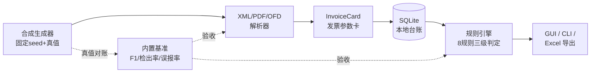

# invoice-ledger-checker

**电子发票智能台账与重复报销检测桌面应用**——全离线、规则引擎为主、零 API 依赖的发票台账与异常检测工具。

> 🚧 **状态：v0.1.0，按里程碑交付中（M1 数据先行已完成）**。路线图见下。

## 它解决什么问题

随着全面数字化的电子发票（数电票）自 2024 年 12 月起全国推广（国家税务总局公告 2024 年第 11 号，新增 XML 数据电文格式），企业报销票据全面电子化，财务痛点集中爆发：

- **同一张发票被多名员工重复报销**——三档重复检测（精确/联合键/模糊）
- **连号发票拆分报销**——同销售方邻近日期连号簇检测
- **票面金额与报销单不符**——票面算术复核（金额+税额=价税合计、大小写一致）

商业费控 SaaS 均为闭源在线服务；本项目提供**桌面端、本地 SQLite 存储、断网可用**的开源替代，数电票 XML 解析器在开源界几乎空白，是本项目的核心亮点。

## 特性（按里程碑交付）

| 特性 | 状态 |
|---|---|
| 合成发票生成器：固定 seed 可复现（位级一致），程序化植入 9 类已知异常 + 真值 JSON，60 份样本入仓（XML/PDF/OFD） | ✅ M1 |
| 法规知识库：764号令/《发票管理办法》原文核对入库，11号公告/56号令待核对挂渠道 | ✅ M1 |
| 数电票 XML 数据电文解析器（stdlib ElementTree，规则优先） | M2 |
| 版式 PDF 文本层解析（pdfplumber，label-slot 规则） | M2 |
| OFD 解析（加分项） | P2 |
| SQLite 本地台账：增删改查、多维筛选（月/供应商/类型/金额区间） | M3/M5 |
| 异常检测规则引擎：重复报销×3 / 连号拆分 / 时间逻辑×2 / 票面算术×2，三级判定（确认/疑似/待人工确认）挂证据 | M3（种子规则 R-ARITH-01/R-DUP-01 已随骨架交付） |
| 内置评测基准：字段解析 F1、检出率/误报率，零 API 可复现 | M4 |
| PySide6 桌面界面 + QtCharts 统计看板 | M5 |
| Excel 台账导出（openpyxl，条件格式标红） | M5 |
| PyInstaller 打包 Windows exe，双击即用 | M5 |

## 快速开始（开发态）

```bash
git clone https://github.com/yuluo554/invoice-ledger-checker.git
cd invoice-ledger-checker

# Windows 自带 Python 3.8 的老 pip 无法可编辑安装，先升级（Linux/Mac 可跳过升级步）
py -m pip install -U pip
py -m pip install -e ".[dev]"

# 冒烟：65 项测试全绿（核心逻辑零第三方依赖；PDF 相关测试缺 reportlab 时自动 skip）
py -m pytest

# 命令行演示：三张合成票入库 -> 查重 -> 算术复核 -> 异常清单
py -m invoice_ledger_checker demo

# 合成发票数据集 + 真值 JSON（同 seed 重跑逐字节一致；PDF 输出需 `pip install -e ".[data]"`）
py -m invoice_ledger_checker generate --out data --seed 42 --n 60

# 可选依赖体检（pdfplumber/PySide6/openpyxl 等 extras 可用性）
py -m invoice_ledger_checker doctor
```

> Windows 控制台中文乱码时用 `py -X utf8 -m invoice_ledger_checker demo`。
> 安装后也可用等价的 `invoice-ledger` 命令（脚本位于 Python Scripts 目录，需在 PATH）。
> 桌面 GUI：`py -m pip install -e ".[desktop]"` 后 `py -m invoice_ledger_checker app`（M5 交付）。

## 架构



核心逻辑（模型/存储/规则/引擎）只用 Python 标准库；重量级库全部 extras 惰性导入——评测与命令行核心零 API、零网络依赖。设计文档：[plan/03-架构与技术选型.md](plan/03-架构与技术选型.md)。

## 评测基准（M4 交付后回填指标）

| 指标 | 目标 | 实测 |
|---|---|---|
| 字段解析 F1 | ≥ 0.95 | 待 M4 |
| 异常检出率 | 100% | 待 M4 |
| 误报率 | 0 | 待 M4 |

## 目录结构

```
├── plan/          # 计划文档（需求/架构/详设/里程碑/决策——单一事实源）
├── data/          # 合成发票样本 + 真值 + 法规知识库（台账登记来源）
├── src/invoice_ledger_checker/
│   ├── models/    # InvoiceCard 发票参数卡（统一中间表示）
│   ├── parsing/   # XML / PDF / OFD 解析器
│   ├── storage/   # SQLite 台账
│   ├── rules/     # 检测规则引擎（error/suspicious/review 三级）
│   ├── generator/ # 合成发票生成器（固定 seed）
│   ├── benchmarks/# 评测基准
│   ├── export/    # Excel 导出
│   ├── app/       # PySide6 桌面入口
│   └── cli.py     # 命令行入口
└── tests/         # pytest（核心逻辑 stdlib-only 可跑）
```

## 路线图

| 里程碑 | 内容 | 状态 |
|---|---|---|
| M0 | 计划 00-06 + 可运行骨架 | ✅ 2026-10-05 |
| M1 | 数据先行：合成发票生成器（位级可复现）+ 真值 + 法规知识库 | ✅ 2026-10-06 |
| M2 | 解析层：XML/PDF 双解析器 → 发票参数卡 | ⬜ |
| M3 | SQLite 台账 + 规则引擎八规则全量 | ⬜ |
| M4 | 内置基准达标（F1≥0.95 / 检出 100% / 误报 0） | ⬜ |
| M5 | PySide6 桌面交付 + Excel 导出 + PyInstaller exe | ⬜ |
| M6 | 脱敏发布 GitHub + Release（exe） | ⬜ |

## 边界与免责声明

- 本项目是**检测辅助定位工具，不是审批决策工具**：输出三级异常清单供人工复核，最终判断由财务人员做出。
- 不做发票验真（不调用税务接口）、不做 OCR（拍照/手写票据）、不做报销审批流。
- 仓库内一切发票样例、公司名、纳税人识别号均为**程序合成的虚构数据**，与任何真实主体无关。
- 全部数据本地处理（SQLite），无任何网络上传。

## License

[MIT](LICENSE)
