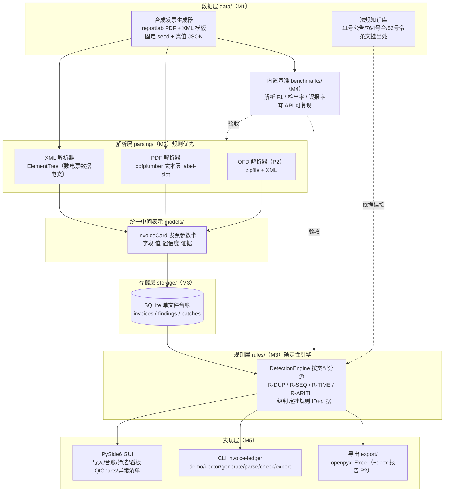

# 03 架构与技术选型

> 前置：[02-需求解读.md](02-需求解读.md)。本文定架构分层、目录结构、依赖分层策略与关键风险。
> 环境硬约束（2026-10-05 实测）：本机唯一解释器 **Python 3.8.8** → 所有选型必须兼容 3.8，`requires-python = ">=3.8"`。

## 1. 总体架构：六层流水线



**数据流向**：生成器（M1）产样例+真值 → 解析器（M2）产 InvoiceCard → 入库 SQLite（M3）→ 规则引擎消费台账产 Finding → GUI/CLI/导出（M5）呈现 → 基准（M4）用真值对账解析层与规则层。

**LLM 位置**：默认路径完全没有 LLM。可选拦截点仅一个——解析层低置信度字段兜底（FR-17，P2）；数值结论永远来自确定性规则，LLM 输出必须过"原文子串校验 + 数值合法性范围"两道门，不可达即降级规则通路（系列既定纪律）。

## 2. 目录结构（src 布局，骨架已按此落地）

```
invoice-ledger-checker/
├── .github/workflows/ci.yml      # CI：windows 3.8/3.12 + ubuntu 3.12
├── .gitattributes                # * text=auto eol=lf（冻结 fixtures 的 EOL 门，M1 起生效）
├── data/                         # 数据台账（README 登记来源/许可/白名单）
│   ├── invoices/  ground_truth/  knowledge/  samples/
├── plan/                         # 计划文档 00-06 + HANDOFF（单一事实源）
├── src/invoice_ledger_checker/
│   ├── cli.py                    # argparse 入口：demo/doctor/generate/parse/check/export/app
│   ├── utils.py                  # 强制 UTF-8 stdio、可选依赖惰性导入
│   ├── models/invoice.py         # InvoiceCard / LineItem（stdlib dataclass）
│   ├── parsing/                  # base.py + xml/pdf/ofd 解析器
│   ├── storage/ledger.py         # SQLite 台账（stdlib sqlite3）
│   ├── rules/                    # engine.py + checks/（arith 种子规则随骨架交付）
│   ├── generator/synthetic.py    # 合成发票生成器（M1）
│   ├── benchmarks/               # F1/检出率指标（M4）
│   ├── export/excel.py           # openpyxl 导出（M5）
│   └── app/main.py               # PySide6 入口（M5）
└── tests/                        # stdlib-only 冒烟 + 各里程碑回归
```

分层依赖方向：`models` 无依赖 ← `parsing/storage/rules/generator` ← `cli/app/benchmarks`。**models、storage、rules、utils 只用 stdlib**——这保证评测与核心逻辑零 API 依赖可复现（NFR-3），重量级库全部推到外围模块并惰性导入。

## 3. 技术选型表（含 3.8 兼容性约束）

| 层 | 选型 | 版本约束 | 理由 | 落位 |
|---|---|---|---|---|
| 语言 | Python | ≥3.8 | 本机唯一解释器 3.8.8（实测）；语法限 3.8（无 match、无 PEP604 联合类型标注） | pyproject |
| GUI | PySide6 + **PySide6-Addons**（QtCharts 在 Addons 包） | py<3.9 锁 `>=6.5,<6.7`；py≥3.9 放开 | ✅ M5 实测复核（2026-10-06，pip download）：6.6.3.1 发 cp38-abi3 wheel 且为 <6.7 内最新可解析版（6.5.0/6.6.x 线均有 cp38-abi3）；QtCharts 离屏冒烟通过；6.7+ 元数据 requires-python≥3.9 与"无 cp38 wheel"结论一致；LGPL 商用友好，比 PyQt 免 GPL 争议 | extras: desktop |
| PDF 文本层 | pdfplumber | ≥0.10（支持 3.8） | 词级坐标便于 label-slot 规则与证据定位；纯 Python 依赖链简单 | extras: parse |
| XML 解析 | stdlib `xml.etree.ElementTree` | — | 数电票 XML 是规范数据电文，无需 lxml；namespace 处理见 [04](04-模块详设.md) | 核心零依赖 |
| OFD | stdlib `zipfile` + ElementTree | — | OFD 本质是 zip 包内 XML 集（GB/T 33190） | 核心零依赖 |
| 存储 | stdlib `sqlite3` | — | 单文件零部署；FTS 全文检索 P2 再议 | 核心零依赖 |
| 台账筛选 | SQL WHERE 组装（参数化） | — | 维度固定（月份/供应商/类型/金额区间），无需 ORM | storage |
| 生成器 | reportlab | ≥3.6（支持 3.8） | 造 PDF 版式文件可控文本层；XML 直出 stdlib | extras: data |
| Excel 导出 | openpyxl | ≥3.1（支持 3.8） | 条件格式标红、多 sheet | extras: export |
| docx 报告 | python-docx | P2 | 可选项，进度风险首顺延之一 | extras: report |
| 打包 | PyInstaller | ≥6.0（支持 3.8：锁 `<7`） | ✅ M5 实测复核（2026-10-06）：6.22.3 为 py3.8 可解析的 6.x 最新版（pip download 验证），本地从 5.13.2 升级；onedir 模式（启动快）；Qt 插件/资源 hooks 成熟；**主 .spec 入仓**保证可复现构建 | extras: pack |
| CLI | stdlib `argparse` | — | 子命令少，不引 typer/click | 核心 |
| 测试 | pytest | ≥7（8.3.5 本机实测可用） | 系列惯例 | extras: dev |
| CI | GitHub Actions：windows-latest×(3.8,3.12) + ubuntu-latest×3.12 | — | win-3.8 镜像开发机（最能抓环境差），ubuntu-3.12 验前向兼容 | ci.yml |
| LLM 兜底 | openai SDK（兼容端点） | P2，默认不装 | 仅解析兜底；`enable_thinking=false`、摘录子串校验、失败降级 | extras: llm |

> ~~**待核对标注**：PySide6 各版本 cp38 wheel 覆盖、PyInstaller 对 3.8 的支持底线~~ ✅ 已核对（2026-10-06，M5 首项）：PySide6 6.6.3.1 cp38-abi3 wheel 可用（extras `>=6.5,<6.7` 解析命中）、QtCharts（PySide6-Addons 6.6.3.1）离屏冒烟通过；PyInstaller 6.22.3 支持 py3.8（`>=6,<7` 内最新）。

## 4. 依赖分层与 extras 策略（系列纪律的落地）

- **核心零依赖**：`pyproject dependencies = []`；解析（非 XML/OFD）、生成、GUI、导出全部进 optional extras：`dev / parse / data / desktop / export / report / llm / all`。
- **惰性导入范式**（utils.import_optional）：缺依赖抛带安装提示的异常（`pip install -e .[desktop]`），CLI 捕获后打印说明、退出码 2，不崩溃。
- **extras 必须覆盖运行期真实 import**（含框架隐式依赖，如后续若用 FastAPI 才需要的 python-multipart 类坑——本项目 GUI 路线风险低但纪律同）：M5 加 Web 外任何新 import 时同步补 extras + 回归测试锁声明。
- **测试期 import 同理**：tests 只允许 stdlib + pytest 模块级导入；重量依赖测试用 `import_optional` 在函数体内做，依赖缺失时显式 `pytest.skip` 并**计数上报**（防"静默少跑"——干净环境与 dev 环境 pytest 收集数必须一致）。

## 5. 关键技术风险与对策

| # | 风险 | 影响 | 对策 | 状态 |
|---|---|---|---|---|
| 1 | **数电票官方 XML 无公开 schema/样例**，真实结构未知 | 解析器字段映射可能返工 | 生成器自定义规范 XML（题目允许自制数据）；同时 M1 查证官方样例渠道（国家税务总局发票服务平台说明、开票软件导出样例、开源参考实现），字段映射表标注"待核对"，两套映射并存由配置切换 | M2 收口：synthetic-v1 映射定稿（TEMPLATE_REFERENCE §1，冻结数据对账 F1=1.0）；官方样例仍未获取，两套映射切换预案保留至 M2+ |
| 2 | PDF 版式发票文本层顺序不定（多栏、印章遮挡） | label-slot 规则漏抽 | pdfplumber 词坐标 + 标签邻近聚类（系列已验证手法）；解析失败降级"待人工确认"而非硬判 | 常规 |
| 3 | PyInstaller + PySide6 体积大、杀软误报、缺 Qt 插件 | 交付质量分 | onedir + 主 spec 入仓；打包机为 win-3.8 CI 同环境；Release 附 sha256 | M5 处理 |
| 4 | GBK 控制台/中文路径（Windows 实测坑） | CLI 崩溃、路径解析错 | CLI 启动强制 stdout UTF-8（骨架已内置）；路径全部 pathlib；专项测试 | 骨架已防 |
| 5 | 固定 seed 生成物在 Windows 全局 autocrlf 下位级漂移 | 基准复现失败 | `.gitattributes` `* text=auto eol=lf` 现在就配（骨架已配）；冻结文件出现 CR 即大声失败的守门测试随 M1 加 | 骨架已防 |
| 6 | 本机 3.8 单解释器，高版本语法/API 混入 | 干净环境/CI 3.12 或他人环境崩 | CI ubuntu-3.12 常驻跑全量测试；`py38-兼容` 写进 HANDOFF 既定口径 | CI 已配 |
| 7 | 模糊重复阈值不当→误报爆炸 | 误报率 0 门槛 | 模糊档仅作"疑似"级（不进"确认异常"）；阈值实验记录进基准报告 | M3 处理 |

## 6. 打包与交付形态（M5 预案，提前定策略）

- **主形态**：PyInstaller onedir，产出 `InvoiceLedgerChecker/` 目录 + 内部启动 exe；Release 打 zip 附 sha256。
- `.spec` 主文件入仓（`.gitignore` 已相应去掉 `*.spec` 忽略），构建命令入 README：`pyinstaller packaging/invoice_ledger_checker.spec`。
- GUI 启动失败兜底：桌面入口依赖缺失时给出可读提示并写日志（不闪退）。
- **演示材料**：README GIF/截图（窗口操作录屏），全部素材自制合成票面，无隐私内容。
